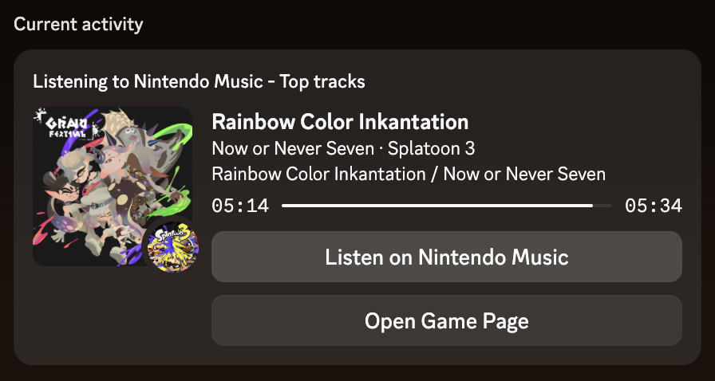

# Nintendo Music RPC

Show what you're listening to on [Nintendo Music](https://music.nintendo.com) in your Discord status via Rich Presence, and scrobble it to [last.fm](https://www.last.fm/)!

<p align="center">
    
</p>

## How it works

Two components work together:

- **Browser extension** — reads the currently playing track from Nintendo Music and sends it to the desktop app.
- **Desktop app (Electron)** — receives track data from the extension over a local HTTP server and updates Discord Rich Presence as well as scrobbles to last.fm

## Setup

1. Download and run the **Nintendo Music RPC** desktop app from the [latest release](https://github.com/Bentheminernz/Nintendo-Music-RPC/releases/latest).
2. Install the browser extension
    - [Chrome](https://chromewebstore.google.com/detail/nintendo-music-discord-rp/boiekifeicdcjjjfeinllgcmnmmbgegf)
    - [Firefox](https://addons.mozilla.org/en-US/firefox/addon/nintendo-music-discord-rpc/)
3. Open Nintendo Music and start playing — your status will update automatically.

### Alternative Installation Methods
Homebrew
```zsh
brew tap Bentheminernz/tap
brew install --cask nintendo-music-rpc
```

## Support my work!
Hi there, if you like Nintendo Music RPC, or any of my other works and are in a position where you can support me financially then I'd be unbelievably grateful if you donated to my [GitHub Sponsors](https://github.com/sponsors/bentheminernz) it would go a long way!
<br>If you're unable to, please don't!!! Sharing my work and starring it still goes a long way.
<br>Thank You! 💛

## Development

### Prerequisites

- Node.js
- Discord desktop app

### Build & run

```zsh
npm install
npm start        # build + launch Electron app
npm run build    # TypeScript compile only
npm run dist     # package as distributable (DMG/NSIS/AppImage)
```

The extension lives in `extension/` and can be loaded unpacked from your browser's extension settings.
